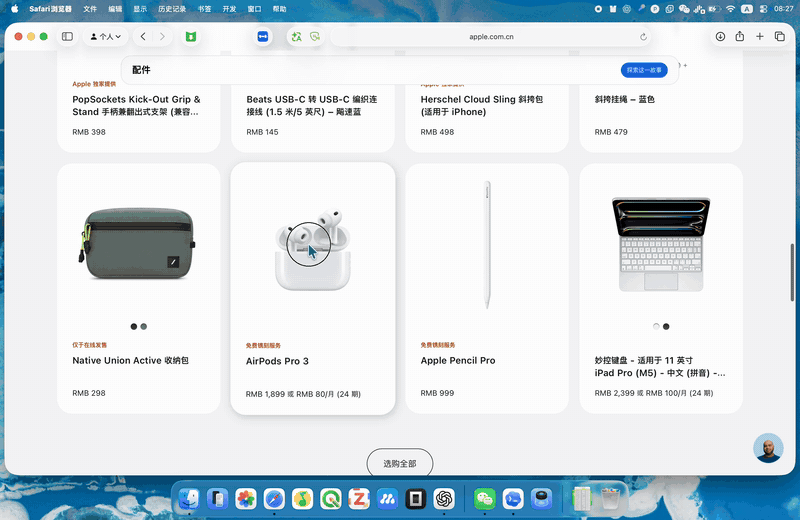
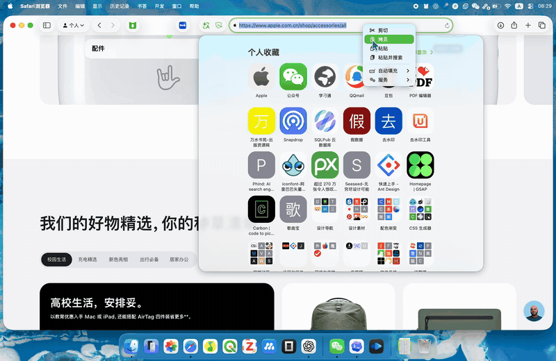
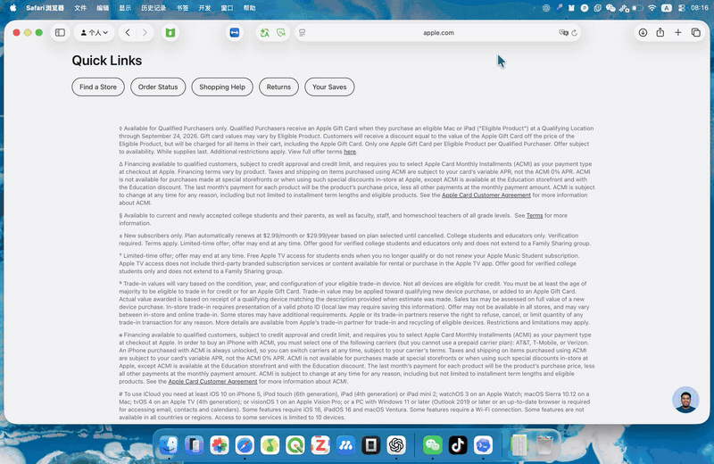
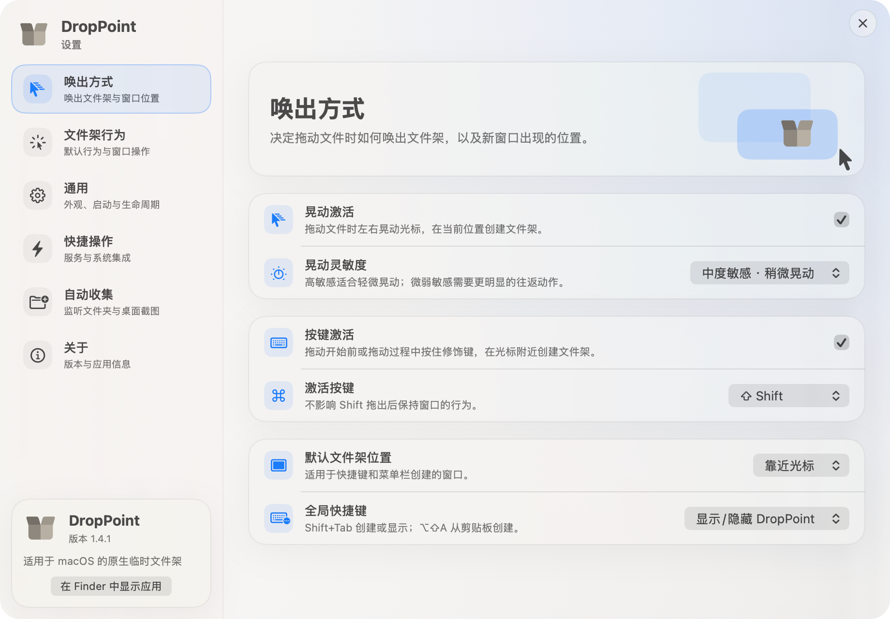

<div align="center">
  
  <h1>DropPoint for macOS</h1>
  <p>用 SwiftUI 与 AppKit 构建的原生 macOS 临时文件架。</p>
  <p>
    <a href="https://github.com/sanbu3/DropPoint-macOS/releases">下载</a>
    ·
    <a href="#功能">功能</a>
    ·
    <a href="#从源码构建">构建</a>
    ·
    <a href="#作者与致谢">致谢</a>
  </p>
</div>

> [!IMPORTANT]
> 本仓库只包含原生 macOS 实现，不包含 Electron、Node.js、网页前端或跨平台运行时。

DropPoint 是一个随手可用的临时文件架。拖动文件、文件夹或图片时，通过摇晃鼠标快速唤出文件架；把内容暂存其中，切换窗口、桌面或全屏空间后再拖到目的地。所有文件处理均在本机完成。

## 演示

### 拖拽、摇晃与放置

拖动文件时摇晃鼠标即可在光标附近生成文件架。文件成功放入后，文件架会保留；若本次拖拽结束仍未放入内容，摇晃生成的空文件架会自动关闭。

<p align="center">
  
</p>

### 复制放置与 Quick Look 预览

文件架支持暂存多个项目。单文件状态，或展开后选中某个项目时，按下空格即可调用 macOS Quick Look；收起或关闭文件架时，相关预览窗口也会一并关闭。

<p align="center">
  
</p>

### 从剪贴板创建内容

复制文件后可使用 `⌥⇧A` 从剪贴板创建文件架，也可以在空文件架中使用 `⌘V` 粘贴文件内容。

<p align="center">
  
</p>

### 原生设置

设置窗口集中管理唤出方式、拖放行为、贴边、快捷操作和自动收集。放置后自动贴边默认关闭；需要时可自行启用，并指定立即贴边或等待 1–30 秒后贴边。

<p align="center">
  
</p>

## 功能

- 原生 SwiftUI / AppKit 窗口、菜单栏和系统拖放体验
- 文件、文件夹、Finder 项目及网页图片暂存
- 单文件紧凑视图，以及多文件选择和展开视图
- 空格调用 macOS Quick Look 预览
- 复制、移除、清空、系统分享和在 Finder 中显示
- 拖动文件时摇晃鼠标或按住修饰键快速创建文件架
- 全局快捷键和剪贴板快速创建
- 拖入区域触觉反馈；离开后再次进入会再次反馈
- 放置后自动贴边开关、0–30 秒延迟和左右角落选择
- 双指轻点立即贴边，双指下滑越过阈值后清空文件架
- 监听指定本地文件夹，并独立识别桌面新截图
- 排除应用内部拖出、文件恢复等事件，避免重复创建文件架
- `⌘W` 关闭当前文件架，`⇧⌘T` 恢复最近关闭的内容
- 深色模式、减少动态效果和原生偏好持久化

## 系统要求

- macOS 14 Sonoma 或更高版本
- Apple silicon 或 Intel 64 位 Mac
- Release 构建为 `arm64 + x86_64` Universal App

## 安装

1. 前往 [Releases](https://github.com/sanbu3/DropPoint-macOS/releases) 下载最新 DMG。
2. 打开 DMG，把 `DropPoint.app` 拖入“应用程序”文件夹。
3. 首次启动时，如 macOS 提示来源未验证，请在 Finder 中右键应用并选择“打开”。

当前公开构建使用本地签名，尚未使用 Apple Developer ID 公证。请只从本仓库 Release 页面下载，并按需核对 Release 中公布的 SHA-256；不建议关闭 Gatekeeper。

## 使用方法

1. 从 Finder、浏览器或其他应用开始拖动文件。
2. 摇晃鼠标生成文件架，或把内容放入已有文件架。
3. 切换到目标窗口、桌面或空间。
4. 从文件架把内容拖到目标位置。

常用操作：

| 操作 | 结果 |
| --- | --- |
| `⇧Tab` | 新建或显示文件架，具体行为由设置决定 |
| `⌥⇧A` | 从剪贴板创建文件架 |
| `⌘V` | 把剪贴板中的文件放入当前文件架 |
| `Space` | 预览单文件或展开状态下选中的项目 |
| `⌘W` | 关闭当前文件架 |
| `⇧⌘T` | 恢复最近关闭的内容 |
| 双指轻点 | 立即移动到设置的贴边角落 |
| 双指下滑 | 越过触觉阈值后清空当前文件架 |

## 自动收集与截图识别

DropPoint 可以监听用户指定的本地目录，也可以单独识别桌面上的新截图：

- 普通目录监听按设置的文件类别收集新增内容。
- 截图监听仅处理图片，并结合系统截图元数据和常见截图文件名识别。
- 从废纸篓恢复、移走后恢复或重新出现的旧截图不会作为新截图收集。
- 应用内部把文件拖到桌面时，会暂时忽略对应目录变化，避免再次生成文件架。

## 权限与隐私

- “输入监控”用于识别全局文件拖动、修饰键和摇晃手势。
- 文件夹及桌面截图监听只观察用户启用的本地目录。
- 文件内容、缩略图、Quick Look 预览和目录变化均在本机处理。
- DropPoint 不需要账户，也不会把文件上传到自有服务器。
- AirDrop、信息、邮件等操作由 macOS 系统分享服务处理。

## 从源码构建

需要 Xcode 以及 [XcodeGen](https://github.com/yonaskolb/XcodeGen)。项目不需要 Node.js、npm 或 Electron。

```bash
git clone https://github.com/sanbu3/DropPoint-macOS.git
cd DropPoint-macOS
xcodegen generate
xcodebuild \
  -project DropPointNative.xcodeproj \
  -scheme DropPointNative \
  -configuration Release \
  -derivedDataPath .build/Release \
  ARCHS="arm64 x86_64" \
  ONLY_ACTIVE_ARCH=NO \
  build
```

构建产物位于：

```text
.build/Release/Build/Products/Release/DropPoint.app
```

## 项目结构

```text
Sources/
├── App/          # 应用生命周期与服务装配
├── AppKit/       # 原生窗口、拖放、手势与菜单桥接
├── Models/       # 文件架状态、设置和项目元数据
├── Services/     # 快捷键、目录监听、导入和窗口管理
├── Utilities/    # 几何、贴边与视觉辅助
└── Views/        # SwiftUI 文件架与设置界面
Resources/        # 图标、SVG 和 Info.plist
docs/media/       # README 截图与演示 GIF
Tests/            # 纯逻辑单元测试
```

## 作者与致谢

本原生 macOS 版本由 **王汪旺**（[@sanbu3](https://github.com/sanbu3)）维护，源码位于 [sanbu3/DropPoint-macOS](https://github.com/sanbu3/DropPoint-macOS)。

核心产品灵感来自 Sudev Suresh Sreedevi（[@GameGodS3](https://github.com/GameGodS3)）创建的 [DropPoint](https://github.com/GameGodS3/DropPoint)，谨此致谢。本仓库为使用 SwiftUI 与 AppKit 完成的独立原生实现。

## 开源许可

本项目按 [GNU General Public License v3.0](LICENSE) 发布。你可以在许可证允许的范围内使用、研究、修改和再分发源码；分发修改版或二进制时，须同时履行 GPLv3 对对应源码、许可证文本、版权及修改说明的要求。

本软件按“原样”提供，不附带任何明示或暗示担保。完整条款以 `LICENSE` 为准。

## 贡献

欢迎提交 Issue 或 Pull Request。提交前请确保：

- 修改仅面向原生 macOS 工程，不引入 Electron 或 Node.js 运行时；
- Release 配置能够成功编译；
- 涉及交互时同时考虑键盘、辅助功能和“减少动态效果”；
- 保留 `LICENSE` 及必要的来源说明。
